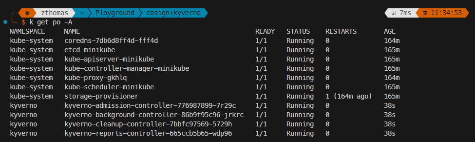

# Docker Image-Signing
Signing docker images is an important step in software supply chain security. Incorporating image signing controls with K8s admission controllers like Kyverno or OPA gatekeeper ensures that only verified images are deployed to clusters. 
This significantly reduces the likelihood of malicious workloads being deployed into otherwise secure environments. 
## Tooling
[Kyverno](https://kyverno.io/docs/introduction/) is a CNCF backed admission controller for Kubernetes environments. It has a powerful policy engine that enforces security best practices by preventing misconfigured workloads from being deployed to a cluster. 
Kyverno has a comprehensive [library](https://kyverno.io/policies/) of policies for different use-cases.

[Cosign](https://github.com/sigstore/cosign) is the main tool of focus here for signing images. Cosign works by using a private key to write a signature to the image repository. This signature can then
be verified by using the public key.
---
### Linux binary Install steps
`curl -O -L "https://github.com/sigstore/cosign/releases/latest/download/cosign-linux-amd64"`

`sudo mv cosign-linux-amd64 /usr/local/bin/cosign`

`sudo chmod +x /usr/local/bin/cosign`

### generate cosign key pair
`cosign generate-key-pair`

### how to sign images
`cosign sign --key cosign.key registry/image@digest --registry-token=token -y`

### verify image signatures
`cosign verify --key cosign.pub registry/image:tag --registry-token=token`

# Enforcing Image Signatures using Kyverno
### Deploy a new K8s cluster using minikube
`minikube start`

### Deploy the kyverno helm chart via terraform
`terraform init`

`terraform validate`

`terraform fmt`

`terraform plan`

`terraform apply`

The kyverno resources have now been applied to the cluster.

### Generate cosign key pair
`cosign generate-key-pair`

Now let's test deploying a sample unsigned image before apply the image verification policy.

`kubectl run random-app --image=zazathomas/silly-demo:1.0.10`

We can see that the image deployed without any issues.

Now modify the `verify-image.yaml` file & replace public key with the contents of the cosign.pub file generated. I'll apply the policy and try deploying the same image again.

This time kyverno blocked the deployment showing details of the policy violation i.e. attempting to deploy an unsigned image.

I'll now go ahead to sign the image using the private key:

`cosign sign --key cosign.key zazathomas/silly-demo:1.0.10`

After signing the image, attempt the deployment again:

This time it works as expected.

This exercise is an important step in software supply chain security.

### Further comments
It is always good practice to have the generated private key stored in a secrets manager like Vault or AWS secrets manager. The ideal workflow for signing images is to include the signing commands after CI commands that push the images to the given repository.
Included in this repository is a [sample-signing.yaml](https://github.com/zazathomas/docker-image-signing/blob/main/.github/workflows/sample-signing.yaml) file which is a GitHub actions workflow for signing images after pushing to dockerhub. Reuse this file by modifying the image, public & private keys as required.
